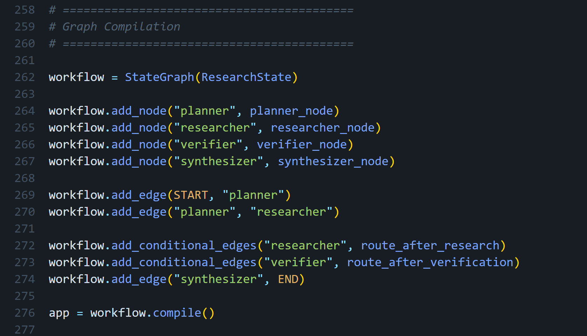
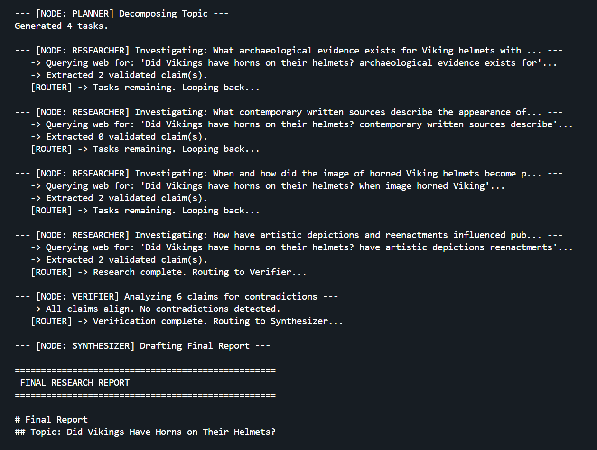
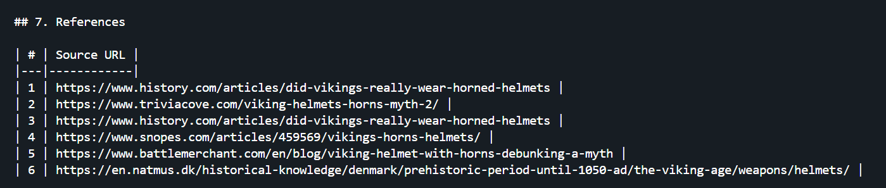

# Deep Research & Evidence Verification Agent

A production-grade, state-driven AI agent built with **LangGraph** that autonomously decomposes complex queries, conducts iterative web research, verifies claims for contradictions, and synthesizes a fully cited final report.

This project represents a transition from simple reactive AI loops to deterministic, graph-based agentic workflows.

## 🧠 Architecture Overview

Unlike standard chatbots that rely on an LLM to decide when a task is finished, this system enforces workflow logic at the graph layer using **LangGraph**. The LLM is utilized purely for cognitive tasks within strictly defined nodes.



### Core Nodes

1. **Planner**  
   Takes a complex topic and decomposes it into 2–4 independently researchable sub-questions using Pydantic structured outputs.

2. **Researcher**  
   Iteratively formulates precise web queries, executes DuckDuckGo searches, and extracts verifiable factual claims with their source URLs.

3. **Verifier**  
   Acts as a circuit breaker. It analyzes collected evidence for contradictions. If sources conflict, it dynamically generates a new research task and routes the graph **backwards** to the Researcher to resolve the discrepancy.

4. **Synthesizer**  
   Drafts a professional, Markdown-formatted final report based exclusively on verified evidence, mapping claims to inline URL citations.



## 🛠️ Tech Stack

- **Frameworks:** LangGraph, LangChain
- **Model:** Groq API — `openai/gpt-oss-120b`
- **Data Validation:** Pydantic
- **Web Search:** DuckDuckGo Search (`ddgs`)
- **Configuration:** `python-dotenv`

## ✨ Key Engineering Features

- **Strict State Management:** Replaces messy chat-history arrays with strongly typed state containing tasks, answered tasks, evidence, and verification results.
- **Context-Aware Query Generation:** Prevents context collapse by algorithmically combining the root topic with sub-question keywords before searching the web.
- **Algorithmic Verification:** Uses LLM reasoning to compare collected claims and detect historical or factual discrepancies before synthesis.
- **Iterative Research Loop:** Allows the graph to return to the Researcher when evidence is insufficient or contradictory.
- **Structured Outputs:** Uses Pydantic schemas to constrain LLM-generated plans, claims, and verification decisions.
- **Graceful Error Handling:** Implements circuit breakers for failed web searches and schema violations, helping prevent the autonomous workflow from crashing.



## 🚀 Getting Started

### Prerequisites

- Python 3.10+
- A [Groq API Key](https://console.groq.com/keys)

### Installation

#### 1. Clone the repository

```bash
git clone https://github.com/YOUR_USERNAME/Agentic_AI_Projects_AI_Engineering.git
cd Agentic_AI_Projects_AI_Engineering/deep-research-agent
```

#### 2. Install dependencies

```bash
pip install langgraph langchain-groq pydantic python-dotenv ddgs
```

#### 3. Configure environment variables

Create a `.env` file in the project directory:

```env
GROQ_API_KEY=your_api_key_here
```

### Execution

Run the agent:

```bash
python agent.py
```

## 🔄 Workflow

The high-level execution flow is:

```text
User Query
    │
    ▼
┌──────────┐
│  Planner │
└────┬─────┘
     │
     ▼
┌────────────┐
│ Researcher │◄──────────────┐
└─────┬──────┘               │
      │                      │
      ▼                      │
┌────────────┐               │
│  Verifier  │───────────────┘
└─────┬──────┘   Conflict / Missing Evidence
      │
      │ Verified
      ▼
┌─────────────┐
│ Synthesizer │
└──────┬──────┘
       │
       ▼
 Final Cited Report
```

The important design characteristic is the **Researcher → Verifier → Researcher** feedback loop. Verification is not performed only after the entire workflow finishes; it can actively create additional research work when evidence is contradictory or incomplete.

## 📌 Project Goals

This project demonstrates practical implementation of:

- Stateful agentic workflows
- Graph-based orchestration
- LLM structured outputs
- Autonomous task decomposition
- Iterative web research
- Evidence collection
- Contradiction detection
- Self-correcting research loops
- Citation-aware report generation
- Error handling and workflow control

## 📁 Expected Project Structure

```text
deep-research-agent/
├── agent.py
├── .env
├── README.md
└── asset/
    ├── 1_final_report_citations.png
    ├── 2_agentic_execution_loop.png
    └── 3_langgraph_architecture.png
```

> Keep the `asset/` directory alongside `README.md` so the architecture images render correctly on GitHub.

## 🔐 Environment Variables

| Variable | Description | Required |
|---|---|---|
| `GROQ_API_KEY` | API key used to access the Groq model | Yes |

Never commit your `.env` file or expose API keys in source control.

A basic `.gitignore` entry should include:

```gitignore
.env
__pycache__/
*.pyc
```

## 🧪 Example Use Case

The agent can be used for questions that require multiple sources and verification rather than a single factual lookup.

Example:

```text
Research the current state of open-source multimodal AI models,
compare their capabilities, identify conflicting benchmark claims,
and produce a cited report.
```

The agent can:

1. Decompose the request into focused research tasks.
2. Generate targeted search queries.
3. Collect factual claims and source URLs.
4. Compare evidence across sources.
5. Detect contradictions.
6. Generate additional research tasks when required.
7. Produce a final report with citations.

## 🏗️ Engineering Philosophy

The core design principle is:

> **Use the LLM for reasoning, but use the graph for control.**

Instead of allowing an LLM to freely determine the entire execution flow, LangGraph defines the workflow boundaries and state transitions. This makes the system easier to reason about, debug, extend, and test.

The architecture separates:

- **Cognition** — handled by the LLM.
- **State** — represented explicitly in the graph.
- **Control flow** — determined by graph transitions.
- **Validation** — enforced with Pydantic.
- **External information retrieval** — handled by web-search tools.
- **Final synthesis** — restricted to collected and verified evidence.

## 🔮 Potential Extensions

Possible future improvements include:

- Persistent research state using a database or checkpointing backend.
- Parallel execution of independent research tasks.
- Source-quality scoring and ranking.
- Domain-specific source allowlists.
- Search-result deduplication.
- Human-in-the-loop approval before synthesis.
- Additional search providers.
- Automated evaluation of citation accuracy.
- LangSmith tracing and observability.
- FastAPI deployment as an API service.
- Streaming graph execution and intermediate results.
- Automated unit and integration tests for individual graph nodes.

## ⚠️ Limitations

- Web search results can contain outdated or inaccurate information.
- Verification quality depends on the quality and diversity of retrieved sources.
- The system does not guarantee that every real-world claim is correct.
- API availability, model behavior, and search-provider behavior can affect execution.
- The current setup is intended as a portfolio/engineering project and may require additional hardening before production deployment.